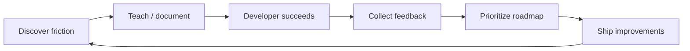

# Developer Advocate Field Guide

A practical, open repository for running developer advocacy as an engineering discipline: **teach clearly, listen systematically, reduce friction, and champion contributors**.

**[Back to the Developer Advocate portfolio](../../README.md)**

This is not a collection of marketing slogans. It contains reusable templates for tutorials, developer feedback, OSS bounties/grants, webinars, issue triage, contributor recognition, and monthly ecosystem reporting.

## Contents

| Area | Template | Outcome |
|---|---|---|
| Tutorials | `templates/tutorial.md` | Repeatable, runnable technical content |
| Grants / bounties | `templates/grant-rubric.md` | Transparent proposal evaluation |
| Feedback | `templates/developer-feedback.md` | Structured product signal |
| Webinars | `templates/webinar-runbook.md` | Consistent live developer sessions |
| Community | `templates/contributor-spotlight.md` | Recognize valuable work |
| Ecosystem | `templates/resource-gap-map.md` | Prioritize missing developer resources |
| Metrics | `templates/monthly-devrel-review.md` | Measure outcomes, not vanity activity |

## Operating model

## Principles

1. **Runnable beats impressive.** Every technical tutorial should leave the reader with working code.
2. **Feedback needs evidence.** Capture context, impact, reproducibility, and affected developer segment.
3. **Recognition compounds.** Highlight contributors so participation feels visible and meaningful.
4. **Grants need transparency.** Publish evaluation criteria before selecting projects.
5. **Measure developer outcomes.** Track time-to-first-success, documentation gaps closed, contributor retention, and repeated support themes.
6. **Respect the domain.** In faith-centered software, correctness, attribution and trust deserve additional care.

## Example 30-day cadence

- Week 1: review issue themes + identify one onboarding gap
- Week 2: publish one runnable tutorial + one short-form demo
- Week 3: host developer office hours/webinar + collect structured feedback
- Week 4: publish contributor spotlight + internal roadmap memo + metrics review

## License

CC BY 4.0 for written templates. Adapt and improve them with attribution.
