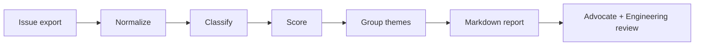

# OSS Feedback Triage

A dependency-free Python CLI for turning a noisy export of GitHub issues into a **prioritized developer-feedback report**.

**[Back to the Developer Advocate portfolio](../../README.md)**

This project demonstrates a Developer Advocate workflow: listen to developers, normalize feedback, identify recurring friction, and give product/engineering teams a transparent prioritization signal.

## What it does

- Classifies issues into documentation, bug, feature, onboarding, data-quality, or community
- Calculates a transparent priority score
- Groups repeated themes
- Produces Markdown suitable for a roadmap or weekly OSS review
- Keeps the scoring model simple enough to challenge and improve

## Usage

```bash
python -m triage.cli examples/issues.json --out report.md
```

## Example scoring model

```text
priority = reactions × 2
         + comments
         + onboarding_bonus
         + bug_bonus
         + recency_bonus
```

The point is not to replace human judgment. It is to make the **first pass explainable**, so advocates and engineers can discuss the same evidence.

## Architecture



## Run tests

```bash
python -m unittest discover -s tests -v
```

## Why this belongs in a DevRel portfolio

Developer advocacy is not only speaking and content. A strong advocate creates a reliable feedback loop between external developers and internal product teams. This repository shows one lightweight way to operationalize that loop.

## License

MIT under the portfolio's [root license](../../LICENSE).
