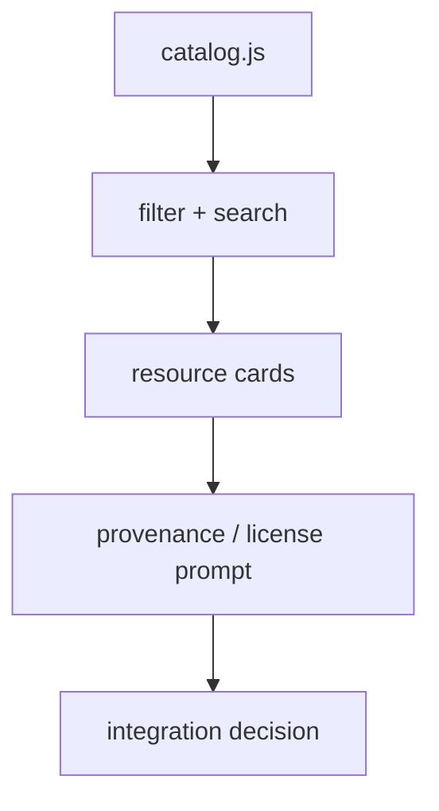

# Qur'an Resource Explorer — Developer Demo

A lightweight browser demo for exploring the **shape and provenance of Qur'anic resources** without bundling sacred text. It is designed as a teaching sample: small enough to understand in minutes, structured enough to extend into a real integration.


**[Try the live demo](https://safwan2025.github.io/developer-advocate-portfolio/quran-resource-explorer/)** · **[Back to the portfolio](../../README.md)**

## Developer-advocacy goal

A good sample project should answer three questions quickly:

1. **What problem does this resource solve?**
2. **How do I integrate it safely?**
3. **Where do I go next?**

This demo models that approach with an intentionally tiny codebase.

## Features

- Search/filter a resource catalog
- Filter by category and format
- Inspect provenance + license notes before integration
- Keyboard-friendly UI
- Zero runtime dependencies
- Responsive layout
- Synthetic catalog metadata only — no Qur'an text is redistributed

## Run locally

```bash
python -m http.server 8080
# open http://localhost:8080
```

## Architecture



## Why provenance is first-class

For Qur'anic applications, correctness is not merely a UX concern. Resource origin, version, license, script, language, and identifiers should be visible in engineering decisions. This example deliberately keeps those fields close to the UI.

## Suggested extensions

- Load a permitted QUL export selected by the developer
- Add JSON/SQLite adapters
- Add resource schema validation
- Add an Arabic/RTL interface
- Add a “report data issue” flow that generates a reproducible issue template

## License

MIT under the portfolio's [root license](../../LICENSE). External Qur'anic resources are not included and retain their own licenses.
